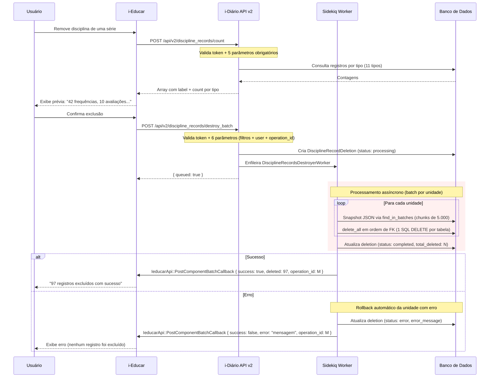
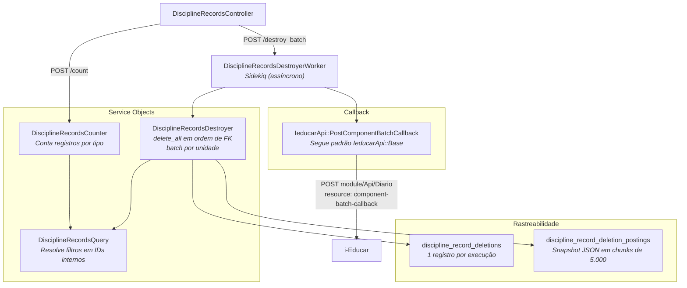
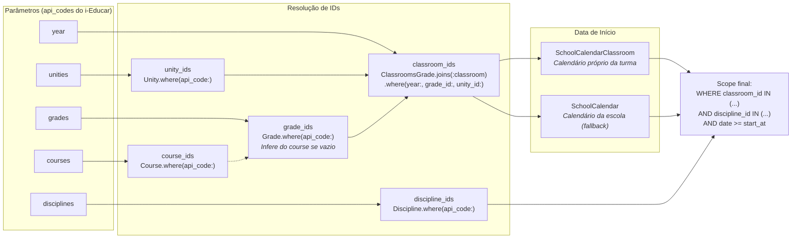
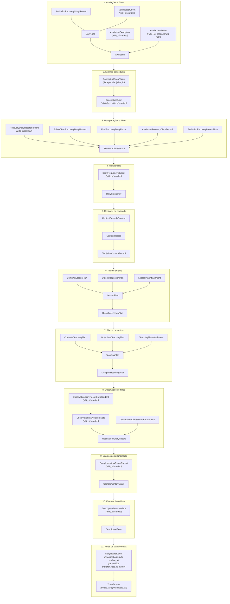

# API v2 — Exclusão em Lote de Registros de Disciplinas

## Visão Geral

Quando um usuário precisa remove componentes curriculares (disciplinas) de séries diretamente na tela do i-Educar, e essas disciplinas já possuem lançamentos no i-Diário (frequências, avaliações, planos de aula, etc.), o i-Educar consome esta API para excluir em lote todos os registros vinculados no i-Diário. Todo o fluxo é iniciado e confirmado pelo usuário na interface do i-Educar.

A API opera em **3 etapas**: contagem (prévia), enfileiramento (assíncrono) e callback (notificação).

---

## Fluxo Geral



---

## Arquitetura Interna



---

## Resolução de Filtros (Query)



---

## Ordem de Exclusão (Destroyer)

A exclusão é processada **por unidade** (cada uma em sua própria transação), seguindo uma ordem específica para respeitar as foreign keys. Antes de cada `delete_all`, o destroyer captura um snapshot JSON via `find_in_batches(batch_size: 5_000)` para possibilitar restauração.



---

## Rastreabilidade e Restauração

### Tabelas de controle

Cada execução do `destroy_batch` cria registros para rastreabilidade:

| Tabela | Descrição | Exemplo |
|--------|-----------|---------|
| `discipline_record_deletions` | 1 registro por execução com filtros, status e total | `filters: {year: 2025, unities_api_code: ["2"], user_api_code: "1"}, total_deleted: 97, operation_id: 42` |
| `discipline_record_deletion_postings` | Snapshot JSON em chunks de 5.000 por tipo de record | `record_type: 'DailyFrequency', records_data: [{id: 101, classroom_id: 5, ...}, ...]` |

### Snapshot JSON

O destroyer captura os **atributos completos** (`.attributes`) de cada registro antes de deletá-lo, usando `find_in_batches(batch_size: 5_000)` para manter o uso de memória constante. Isso inclui:

- Todos os campos do registro (incluindo FKs que a gem Audited exclui via `audited except:`)
- Join tables HABTM sem model (`avaliations_grades`) via `SELECT *` direto (também em batches por IDs)
- Filhos com `dependent: :destroy` que seriam perdidos em cascata (`ContentRecord`, `LessonPlan`, `TeachingPlan` e todos os seus filhos)
- `DailyNoteStudent` vinculados a `TransferNote` (que o `update_all` nullifica antes do `delete_all`)
- Records soft-deleted via `with_discarded` para capturar registros descartados

**Total: 33 record types capturados** em 11 steps de exclusão.

### Record types capturados por step

| Step | Record types no snapshot |
|------|------------------------|
| Avaliações | `Avaliation`, `AvaliationRecoveryDiaryRecord`, `DailyNote`, `DailyNoteStudent`, `AvaliationExemption`, `AvaliationsGrade` |
| Exames conceituais | `ConceptualExamValue`, `ConceptualExam` |
| Recuperações | `RecoveryDiaryRecord`, `RecoveryDiaryRecordStudent`, `SchoolTermRecoveryDiaryRecord`, `FinalRecoveryDiaryRecord`, `AvaliationRecoveryDiaryRecord`, `AvaliationRecoveryLowestNote` |
| Frequências | `DailyFrequency`, `DailyFrequencyStudent` |
| Registros de conteúdo | `DisciplineContentRecord`, `ContentRecord`, `ContentRecordsContent` |
| Planos de aula | `DisciplineLessonPlan`, `LessonPlan`, `ContentsLessonPlan`, `ObjectivesLessonPlan`, `LessonPlanAttachment` |
| Planos de ensino | `DisciplineTeachingPlan`, `TeachingPlan`, `ContentsTeachingPlan`, `ObjectivesTeachingPlan`, `TeachingPlanAttachment` |
| Observações | `ObservationDiaryRecord`, `ObservationDiaryRecordNote`, `ObservationDiaryRecordNoteStudent`, `ObservationDiaryRecordAttachment` |
| Exames complementares | `ComplementaryExam`, `ComplementaryExamStudent` |
| Exames descritivos | `DescriptiveExam`, `DescriptiveExamStudent` |
| Notas de transferência | `TransferNote`, `TransferNoteDailyNoteStudent` |

### Limpeza automática de dados antigos

A rake task `discipline_records:cleanup_old_deletions` remove registros de rastreabilidade que não são mais necessários.

**Critério de limpeza:** `year <= ano_anterior` **E** `created_at < 1 mês atrás`

Exemplo: executada em 11/03/2026, remove deletions com `year <= 2025` e `created_at < 11/02/2026`.

```bash
# Execução manual:
docker compose exec puma bundle exec rake discipline_records:cleanup_old_deletions

# Cron sugerido (1x por mês, dia 1 às 03:00):
0 3 1 * * cd /app && bundle exec rake discipline_records:cleanup_old_deletions
```

---

## Endpoints

### POST `/api/v2/discipline_records/count`

Retorna a contagem de registros que seriam afetados pelos filtros.

**Headers:**
| Header | Descrição |
|--------|-----------|
| `token` | `api_security_token` do `IeducarApiConfiguration` |

**Body (JSON):**
```json
{
  "year": 2025,
  "unities": ["5"],
  "courses": ["22"],
  "grades": ["51", "52"],
  "disciplines": ["10", "15"]
}
```

**Resposta (200):**
```json
[
  { "label": "Frequências diárias", "count": 42 },
  { "label": "Avaliações numéricas", "count": 10 },
  { "label": "Avaliações conceituais", "count": 3 },
  { "label": "Recuperações", "count": 5 },
  { "label": "Registros de conteúdo", "count": 8 },
  { "label": "Planos de aula", "count": 4 },
  { "label": "Planos de ensino", "count": 2 },
  { "label": "Diário de observações", "count": 6 },
  { "label": "Notas de transferência", "count": 1 },
  { "label": "Exames complementares", "count": 3 },
  { "label": "Avaliações descritivas", "count": 0 }
]
```

### POST `/api/v2/discipline_records/destroy_batch`

Enfileira a exclusão dos registros no Sidekiq e retorna imediatamente. O resultado é enviado via callback para o i-Educar usando `IeducarApi::PostComponentBatchCallback`.

**Body (JSON):** Mesmo do `count` + campos `user` e `operation_id`:
```json
{
  "year": 2025,
  "unities": ["5"],
  "courses": ["22"],
  "grades": ["51", "52"],
  "disciplines": ["10", "15"],
  "user": "1",
  "operation_id": 42
}
```

**Resposta (200):**
```json
{ "queued": true }
```

**Resposta (422):**
```json
{ "success": false, "errors": "Parâmetros obrigatórios ausentes: ..." }
```

**Callback (via `IeducarApi::PostComponentBatchCallback`):**

Quando o worker finaliza, envia callback via `IeducarApi::PostComponentBatchCallback` (endpoint `module/Api/Diario`, resource `component-batch-callback`, oper `post`). Autenticação padrão via query params do `IeducarApiConfiguration`. Só é enviado se `operation_id` estiver presente.

```json
// Sucesso
{ "success": true, "deleted": 97, "operation_id": 42 }

// Erro
{ "success": false, "error": "mensagem de erro", "operation_id": 42 }
```

### Validações

| Cenário | Status | Resposta |
|---------|--------|----------|
| Sem header `token` | 401 | `{ "errors": "Token inválido" }` |
| Token incorreto | 401 | `{ "errors": "Token inválido" }` |
| Parâmetros ausentes (count) | 422 | `{ "success": false, "errors": "Parâmetros obrigatórios ausentes: year, unities, ..." }` |
| Parâmetros ausentes (destroy_batch) | 422 | `{ "success": false, "errors": "Parâmetros obrigatórios ausentes: year, ..., user" }` |
| Filtros sem correspondência | 200 | `{ "queued": true }` (callback retorna `deleted: 0`) |
| Erro na exclusão | 200 | `{ "queued": true }` (callback retorna `success: false`) |

---

## Parâmetros

| Parâmetro | Obrigatório | Descrição |
|-----------|-------------|-----------|
| `year` | Sim | Ano letivo |
| `unities` | Sim | Array de `api_codes` das escolas no i-Educar |
| `courses` | Sim | Array de `api_codes` dos cursos |
| `grades` | Sim | Array de `api_codes` das séries |
| `disciplines` | Sim | Array de `api_codes` das disciplinas |
| `user` | Sim (destroy_batch) | `api_code` do usuário que executou a operação |
| `operation_id` | Não | ID da operação no i-Educar para vincular ao callback |

---

## Tipos de Registro Cobertos

| # | Tipo | Model principal | Filhos excluídos / capturados |
|---|------|----------------|-------------------------------|
| 1 | Avaliações numéricas | `Avaliation` | `AvaliationRecoveryDiaryRecord`, `DailyNote`, `DailyNoteStudent`, `AvaliationExemption`, `AvaliationsGrade` |
| 2 | Avaliações conceituais | `ConceptualExam` | `ConceptualExamValue` (filtra por discipline_id, só órfãos são removidos) |
| 3 | Recuperações | `RecoveryDiaryRecord` | `RecoveryDiaryRecordStudent`, `SchoolTermRecoveryDiaryRecord`, `FinalRecoveryDiaryRecord`, `AvaliationRecoveryDiaryRecord`, `AvaliationRecoveryLowestNote` |
| 4 | Frequências diárias | `DailyFrequency` | `DailyFrequencyStudent` |
| 5 | Registros de conteúdo | `DisciplineContentRecord` | `ContentRecord`, `ContentRecordsContent` |
| 6 | Planos de aula | `DisciplineLessonPlan` | `LessonPlan`, `ContentsLessonPlan`, `ObjectivesLessonPlan`, `LessonPlanAttachment` |
| 7 | Planos de ensino | `DisciplineTeachingPlan` | `TeachingPlan`, `ContentsTeachingPlan`, `ObjectivesTeachingPlan`, `TeachingPlanAttachment` |
| 8 | Diário de observações | `ObservationDiaryRecord` | `ObservationDiaryRecordNote`, `ObservationDiaryRecordNoteStudent`, `ObservationDiaryRecordAttachment` |
| 9 | Exames complementares | `ComplementaryExam` | `ComplementaryExamStudent` |
| 10 | Avaliações descritivas | `DescriptiveExam` | `DescriptiveExamStudent` |
| 11 | Notas de transferência | `TransferNote` | `DailyNoteStudent` (snapshot antes do `update_all` que nullifica `transfer_note_id` e `note`, seguido de `delete_all`) |

---

## Arquivos

| Arquivo | Descrição |
|---------|-----------|
| `app/controllers/api/v2/discipline_records_controller.rb` | Controller com endpoints `count` e `destroy_batch` |
| `app/services/api/discipline_records_query.rb` | Resolve api_codes em IDs internos e monta scopes |
| `app/services/api/discipline_records_counter.rb` | Conta registros por tipo usando os scopes da query |
| `app/services/api/discipline_records_destroyer.rb` | Exclui via `delete_all` com snapshot em batches via `find_in_batches` |
| `app/services/ieducar_api/post_component_batch_callback.rb` | Callback para i-Educar seguindo padrão `IeducarApi::Base` |
| `app/models/discipline_record_deletion.rb` | Model de rastreabilidade (1 por execução) |
| `app/models/discipline_record_deletion_posting.rb` | Snapshot JSON por record type (chunks de 5.000) |
| `app/enumerations/discipline_record_deletion_status.rb` | Enumeração de status (processing, completed, error) |
| `app/workers/discipline_records_destroyer_worker.rb` | Worker Sidekiq que processa a exclusão e envia callback |
| `db/migrate/20260306171550_create_discipline_record_deletions.rb` | Migration das tabelas de rastreabilidade |
| `lib/tasks/cleanup_old_discipline_record_deletions.rake` | Rake task de limpeza de dados antigos |
| `config/routes.rb` | Rotas: `POST /api/v2/discipline_records/count` e `destroy_batch` |

---

## Considerações Técnicas

- **Processamento assíncrono:** O `destroy_batch` enfileira um worker Sidekiq e retorna `{ queued: true }` imediatamente. O resultado é enviado via `IeducarApi::PostComponentBatchCallback`.
- **Callback:** Segue o padrão `IeducarApi::Base` do projeto (autenticação via query params do `IeducarApiConfiguration`). Endpoint no i-Educar: `module/Api/Diario`, resource `component-batch-callback`, oper `post`. Só é enviado se `operation_id` estiver presente.
- **Performance (`delete_all`):** Usa `delete_all` (1 SQL DELETE por tabela) ao invés de `destroy!` (N queries com callbacks). O audit trail é garantido pelo snapshot JSON, não pela gem Audited.
- **Batch por unidade:** Cada unidade é processada em sua própria transação, evitando locks longos e permitindo progresso parcial em caso de erro.
- **Memória constante:** Snapshot via `find_in_batches(batch_size: 5_000)` — nunca carrega mais que 5.000 registros na memória, independente do volume total. IDs extraídos via `pluck(:id)` (apenas inteiros).
- **Transação:** Toda a exclusão de uma unidade ocorre dentro de uma transação. Se qualquer `delete_all` falhar, todos os registros daquela unidade são preservados.
- **Idempotência:** Chamar `destroy_batch` duas vezes com os mesmos filtros é seguro — o segundo callback retorna `deleted: 0` (mas cria um novo `discipline_record_deletion` com `total_deleted: 0`).
- **Status:** Cada `DisciplineRecordDeletion` tem status `processing` → `completed` ou `error`, controlado pela enumeração `DisciplineRecordDeletionStatus`.
- **Snapshot JSON:** Os atributos completos são salvos em `records_data` (jsonb) na tabela `discipline_record_deletion_postings`, em chunks de 5.000 registros. Isso captura dados que a gem Audited exclui via `audited except:` e join tables HABTM sem model.
- **HABTM:** A join table `avaliations_grades` não tem model ActiveRecord. O snapshot é capturado via `SELECT *` direto (em batches de IDs) e restaurado via INSERT SQL.
- **TransferNote:** Replica manualmente o `before_destroy` com `update_all(transfer_note_id: nil, note: nil)` seguido de `delete_all`. O snapshot é capturado **antes** do `update_all` com record type `TransferNoteDailyNoteStudent`.
- **Calendário escolar:** As queries usam a data real de início do calendário da turma (`SchoolCalendarClassroom` ou `SchoolCalendar`), não 1º de janeiro.
- **Discardable:** Models com soft-delete são consultados com `with_discarded` tanto na exclusão quanto no snapshot para evitar registros órfãos.
- **Limpeza:** Dados de rastreabilidade são removidos automaticamente via rake task mensal (ano anterior + mínimo 1 mês de criação).
