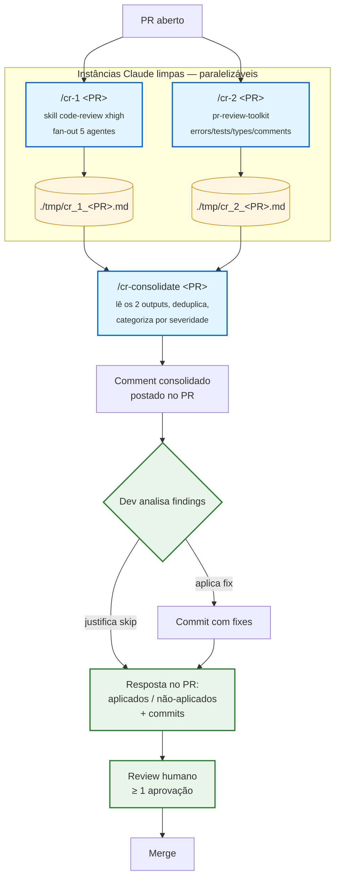

# Code Review Agêntico

> **TL;DR:** Todo PR passa por 3 comandos sequenciais (em instâncias Claude limpas) antes do review humano: `/cr-1` faz review baseline, `/cr-2` faz review especializado, `/cr-consolidate` funde os dois e posta UM comment consolidado no PR. Dev aplica fixes manualmente (sem auto-fix, mantém awareness) e responde no PR com aplicados/não-aplicados.

---

## Sumário

- [Visão geral](#visão-geral)
- [Fluxo](#fluxo)
- [Comandos](#comandos)
- [Como usar — passo a passo](#como-usar--passo-a-passo)
- [Severidades](#severidades)
- [O que cada agente faz](#o-que-cada-agente-faz)
- [Decisões de arquitetura](#decisões-de-arquitetura)
- [Troubleshooting](#troubleshooting)

---

## Visão geral

Code review em **três camadas**:

1. **Self-review do autor** (manual) — antes de abrir o PR
2. **Review agêntico** (3 comandos abaixo) — após abrir o PR
3. **Review humano do time** (manual) — ≥ 1 aprovação obrigatória

A camada 2 não substitui a camada 3 — acelera-a. Os agentes pegam bugs mecânicos, violações de padrão e silent failures, deixando o reviewer humano livre para focar em design, UX e regra de negócio.

---

## Fluxo



---

## Comandos

| Comando | O que faz |
|---|---|
| `/cr-1 <PR>` | Invoca `/code-review xhigh <PR>` (built-in do Claude Code, fan-out 5 agentes). Salva output em `./tmp/cr_1_<PR>.md`. |
| `/cr-2 <PR>` | Invoca `/pr-review-toolkit:review-pr <PR>` (plugin oficial). O LLM decide quais aspects rodar com base no diff. Salva output em `./tmp/cr_2_<PR>.md`. |
| `/cr-consolidate <PR>` | Lê os 2 outputs em `./tmp/`, deduplica por `(file, line, descrição)`, categoriza por severidade (CRITICAL/HIGH/MEDIUM/LOW), posta UM comment consolidado no PR. |

**Pré-requisitos:**
- `/code-review` — comando built-in do Claude Code (não precisa instalar nada)
- `/pr-review-toolkit:review-pr` — plugin oficial Anthropic, já habilitado em `.claude/settings.json` do projeto

### Instalando o plugin `pr-review-toolkit`

O plugin é versionado junto do repo (habilitado em `.claude/settings.json`), mas precisa estar baixado no seu Claude Code local pra funcionar. Se o comando `/pr-review-toolkit:review-pr` não aparecer na lista, instale:

```
/plugin marketplace add claude-plugins-official
/plugin install pr-review-toolkit@claude-plugins-official
```

Verifique a instalação com:

```bash
ls ~/.claude/plugins/marketplaces/claude-plugins-official/plugins/pr-review-toolkit/
```

Se quiser checar quais comandos a skill expõe:

```bash
ls ~/.claude/plugins/marketplaces/claude-plugins-official/plugins/pr-review-toolkit/commands/
```

Após instalar, reinicie o Claude Code (ou rode `/plugins` pra confirmar que `pr-review-toolkit` aparece na lista).

---

## Como usar — passo a passo

### 1. Abre o PR normalmente

```bash
git push -u origin minha-branch
gh pr create
# Suponha PR #1234
```

### 2. Abre instância Claude 1 (limpa) e roda `/cr-1`

```
> /cr-1 1234
```

Pipeline faz checkout do PR, invoca a skill `code-review`, salva output em `./tmp/cr_1_1234.md`. Fecha essa instância.

### 3. Abre instância Claude 2 (limpa) e roda `/cr-2`

```
> /cr-2 1234
```

**Dica:** `/cr-1` e `/cr-2` são independentes — você pode rodar os dois **em paralelo** em duas janelas/abas do terminal pra economizar tempo. Só não rode o `/cr-consolidate` antes dos dois terminarem.

Pipeline faz checkout do PR, detecta aspectos no diff (errors/tests/types/comments), invoca `pr-review-toolkit:review-pr` por aspecto, salva consolidado em `./tmp/cr_2_1234.md`. Fecha essa instância.

### 4. Abre instância Claude 3 (limpa) e roda `/cr-consolidate`

```
> /cr-consolidate 1234
```

Pipeline lê os 2 outputs, deduplica, posta UM comment consolidado no PR.

### 5. Lê o comment e age

- **Findings que fazem sentido:** aplica fixes manualmente. Pode pedir ao Claude no editor pra ajudar (ex: "aplica o finding em `foo.rb:42`"), mas revise cada change antes de commitar.
- **Findings que NÃO vai aplicar:** anota a justificativa (1 linha cada).

### 6. Responde no PR com resumo

Em um comment novo (ou resposta ao comment consolidado):

```markdown
**Resposta ao code review agêntico:**

Aplicados (3):
- `app/services/avaliacao_service.rb:42` — N+1 corrigido (commit abc123)
- `app/controllers/notas_controller.rb:88` — strong params (commit def456)
- `spec/models/student_spec.rb:10` — teste adicionado (commit ghi789)

Não aplicados (2):
- `app/lib/legacy_importer.rb:5` — false positive, código deprecated já agendado pra remoção
- `app/workers/sync_worker.rb:30` — trade-off aceito, rescue genérico é intencional (timeout do i-Educar)
```

### 7. Pede review humano

```bash
gh pr review 1234 --request @username
```

---

## Severidades

| Severidade | Critério | Ação esperada |
|---|---|---|
| **CRITICAL** | Bug que afeta produção, segurança ou integridade de dados (multi-tenant leak, SQL injection, auth bypass, migration destrutiva) | Aplicar fix obrigatoriamente, ou justificar com forte fundamento |
| **HIGH** | Bug com alta probabilidade de causar incidente (N+1 em endpoint quente, missing test pra lógica nova, missing index) | Aplicar fix ou justificar |
| **MEDIUM** | Problema de qualidade (refactor sugerido, método com muitos args, log sem contexto) | Aplicar se fizer sentido no escopo do PR |
| **LOW** | Estilo, sugestão opcional | Opcional |

**Princípio:** dev é responsável pelo julgamento. O comment consolidado é um diagnóstico, não um veredito.

---

## O que cada agente faz

### `/cr-1` — Comando built-in `/code-review` (Claude Code)

- Fan-out de **5 agentes Sonnet paralelos**: CLAUDE.md compliance, shallow bug scan, git blame/history, PRs anteriores tocando os mesmos arquivos, code comments
- Confidence scoring 0-100 por Haiku, threshold ≥80
- Single-pass (sem verifier, sem sweep — esses não fazem parte da skill oficial)
- Posta UM general PR comment começando com `### Code review`

**Effort levels suportados pela skill** (sintaxe: `/code-review [low|medium|high|xhigh|max|ultra] [--fix] [--comment] [<target>]`):

| Level | Comportamento |
|---|---|
| `low`/`medium` | Poucos findings, alta confiança |
| `high`→`max` | Cobertura mais ampla, pode incluir findings menos certeiros |
| **`xhigh`** | Nível que usamos no `/cr-1` (alta cobertura, balanceia entre `high` e `max`) |
| `ultra` | Deep multi-agent review na cloud (mais caro e lento) |

Usamos `xhigh` porque rodamos só quando dev chama (não em CI) — trade-off de mais ruído vs. mais cobertura é aceitável.

### `/cr-2` — Plugin `pr-review-toolkit`

| Agente | Quando dispara | Foco |
|---|---|---|
| `silent-failure-hunter` | `rescue`/`begin`/`catch` no diff | Catch blocks vazios, fallbacks ocultos |
| `pr-test-analyzer` | Spec modificado | Coverage, edge cases, qualidade de assertions |
| `type-design-analyzer` | Classe/módulo novo | Encapsulation, invariants |
| `comment-analyzer` | ≥3 comentários novos não-magic | Accuracy vs código, comment rot |

A skill **não posta no PR** — devolve texto que o `/cr-2` captura.

### `/cr-consolidate`

- Lê `./tmp/cr_1_<PR>.md` e `./tmp/cr_2_<PR>.md`
- Deduplica por `(file, line, descrição similar)` com tolerância ±3 linhas
- Categoriza por severidade
- Posta UM comment estruturado no PR

---

## Decisões de arquitetura

### Por que 3 comandos em vez de 1?

Inicialmente seria viável ter um único comando orquestrando tudo, mas o resultado fica complexo e propenso a bugs (state map, markers HTML, reconciliação entre rodadas, cap de iteração). Separar em 3 comandos resolve:

- **Cada comando faz uma coisa só** — fácil de entender, debugar, e modificar
- **Instâncias Claude separadas** — evitam acumular contexto longo (cada review é independente)
- **Paralelizável** — `/cr-1` e `/cr-2` podem rodar em paralelo (em instâncias diferentes)

### Por que instâncias Claude separadas?

- **Contexto limpo** — Claude não fica enviesado por análises anteriores
- **Independência** — review baseline e especializado não se contaminam
- **Reprodutível** — rodar de novo dá resultado próximo do anterior

### Por que sem auto-fix?

Por dois motivos principais:

1. **Agentic fatigue** — dev shippa código que não escreveu, perde noção do que está em produção.
2. **Awareness > velocidade** — aplicar fixes manualmente força o dev a entender cada change. Pode pedir ao Claude pra ajudar, mas a decisão de aceitar/recusar fica explícita.

### Por que sem aprovação automática?

Aprovação formal de PR é decisão humana, sempre. O comment consolidado diz "esses são os findings" — não diz "aprovado".

### Por que stateless (sem cap de iteração, sem markers)?

- **Cada run é independente.** Dev decide quando rodar de novo (após aplicar fixes, push, ou checkar).
- **Sem state = menos bugs.** Markers HTML, regex de extração de SHA, paginação de comments — tudo isso causava bugs sutis.
- **Convergência via responsabilidade humana.** Dev responde no PR com aplicados/não-aplicados. Não precisa de loop automático.

### Por que `./tmp/`?

`/cr-consolidate` precisa ler os 2 outputs crus pra fazer dedup. `./tmp/` está no `.gitignore` (padrão) e não polui o repo. Arquivos podem ficar lá pro dev consultar manualmente se quiser.

**Sobrescrita:** runs novas em cima do mesmo PR sobrescrevem `cr_1_<PR>.md` e `cr_2_<PR>.md`. Se quiser preservar histórico, copie pra outro nome antes de re-rodar.

### Por que apenas agentes oficiais Anthropic?

O `/code-review` built-in do Claude Code + o plugin oficial `pr-review-toolkit` já cobrem o cenário do time, com suporte garantido, manutenção contínua e zero lock-in externo.

---

## Troubleshooting

### `/cr-consolidate` falha com "cr_1 não existe"

Você esqueceu de rodar `/cr-1 <PR>` antes. Os 3 comandos são sequenciais.

### `/cr-1` aborta com "working tree sujo"

Commit, stash ou descarte mudanças locais antes. O comando faz `gh pr checkout` e precisa de árvore limpa pra não revisar mudanças não relacionadas.

### Skill `code-review` não postou comment

Causa provável: `gh` CLI sem permissão de escrita no repo. Verifique com `gh auth status`; se necessário, `gh auth refresh -s repo`.

### `/cr-2` reporta "Aspectos detectados: nenhum"

Diff do PR não tem `rescue`/`begin`/`catch`, sem spec modificado, sem class/module novo, sem ≥3 comentários novos. Normal pra PRs pequenos ou só de doc. Pode pular pra `/cr-consolidate` direto.

### Comment consolidado tem findings duplicados

Dedup é heurístico (`file:line ±3` + descrição similar). Pode passar duplicata em casos raros. Reviewer humano vê e ignora.

### Quero rodar `/cr-1` num aspecto específico

Não suportado — a skill `code-review` faz fan-out fixo. Para aspecto específico, rode direto `/pr-review-toolkit:review-pr <aspect>` numa instância Claude qualquer.

### Como cancelar um comando em andamento

`Ctrl+C` no terminal. Os arquivos em `./tmp/` ficam pra próxima execução completar (ou são sobrescritos na próxima run).

---

## Manutenção desta doc

- Ajustes nos comandos: editar `.claude/commands/cr-*.md`
- Ajustes em regras de review: editar seção `Code Review Rules` em [CLAUDE.md](../CLAUDE.md)
