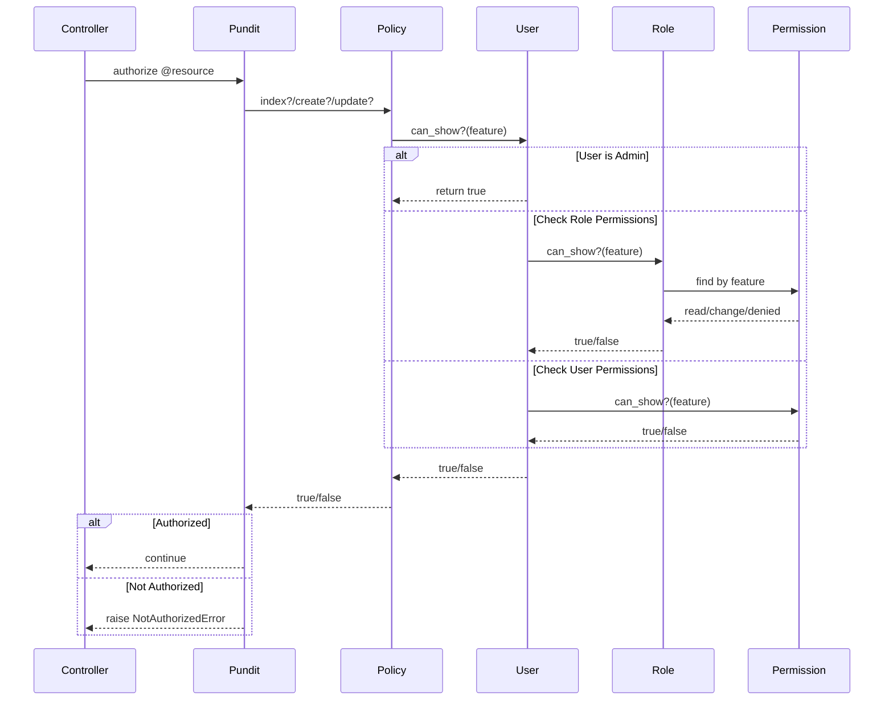

# Sistema de Permissões do i-Diário

## Visão Geral

O i-Diário utiliza um sistema de permissões baseado em **Features** e **Roles** (papéis), implementado com o framework **Pundit**. Este sistema permite controle granular de acesso a funcionalidades específicas do sistema.

## Arquitetura

### Componentes Principais


### 1. Features (Funcionalidades)

Features são identificadores de funcionalidades do sistema. Elas são definidas como uma enumeração em:

```ruby
# app/enumerations/features.rb
class Features < EnumerateIt::Base
  associate_values :absence_justifications,    # Justificativas de falta
                   :avaliations,               # Avaliações
                   :daily_frequencies,         # Frequências diárias
                   :users,                     # Gerenciar usuários
                   :full_synchronization,      # Sincronização completa
                   # ... outras features
end
```

### 2. Permissions (Níveis de Acesso)

Cada feature pode ter três níveis de permissão:

```ruby
# app/enumerations/permissions.rb
class Permissions < EnumerateIt::Base
  associate_values :read,    # Apenas visualização
                   :change,  # Visualização e edição
                   :denied   # Sem acesso
end
```

### 3. Roles (Papéis)

Roles definem conjuntos de permissões para diferentes tipos de usuários:

```ruby
# app/models/role.rb
class Role < ApplicationRecord
  has_many :permissions, class_name: 'RolePermission'
  has_many :user_roles
  
  # Níveis de acesso disponíveis
  has_enumeration_for :access_level, with: AccessLevel
  # administrator, employee, teacher, parent, student
end
```

### 4. Estrutura do Banco de Dados

```sql
-- Tabela de permissões por papel
role_permissions (
  id,
  role_id,        -- ID do papel
  feature,        -- Nome da funcionalidade
  permission,     -- Nível de permissão (read, change, denied)
  created_at,
  updated_at
)

-- Tabela de permissões específicas por usuário
user_permissions (
  id,
  user_id,        -- ID do usuário
  feature,        -- Nome da funcionalidade
  permission,     -- Nível de permissão
  created_at,
  updated_at
)
```

## Como Funciona

### Fluxo de Verificação de Permissão



1. **Controller chama autorização**:
```ruby
class DailyFrequenciesController < ApplicationController
  def index
    @daily_frequencies = DailyFrequency.all
    authorize @daily_frequencies  # Pundit verifica permissões
  end
end
```

2. **Pundit busca a Policy correspondente**:
```ruby
class DailyFrequencyPolicy < ApplicationPolicy
  def index?
    @user.can_show?(:daily_frequencies)
  end
  
  def create?
    @user.can_change?(:daily_frequencies)
  end
end
```

3. **User verifica permissões**:
```ruby
class User < ApplicationRecord
  def can_show?(feature)
    # Admins têm acesso total
    return true if admin?
    
    # Verifica permissões do role
    return true if current_user_role.role.can_show?(feature)
    
    # Verifica permissões específicas do usuário
    permissions.can_show?(feature)
  end
  
  def can_change?(feature)
    return true if admin?
    return true if current_user_role.role.can_change?(feature)
    permissions.can_change?(feature)
  end
end
```

### Hierarquia de Permissões

1. **Usuários Admin** - Acesso total a todas as features
2. **Permissões do Role** - Permissões padrão do papel do usuário
3. **Permissões Específicas** - Sobrescreve permissões do role para usuários específicos

## Adicionando uma Nova Feature

### 1. Adicionar à Enumeração

```ruby
# app/enumerations/features.rb
class Features < EnumerateIt::Base
  associate_values :absence_justifications,
                   # ... outras features
                   :minha_nova_feature  # NOVA FEATURE
end
```

### 2. Adicionar Tradução

```yaml
# config/locales/navigation.yml
pt-BR:
  enumerations:
    features:
      minha_nova_feature: "Minha Nova Funcionalidade"
```

### 3. Criar Policy (Quando Necessário)

#### Quando NÃO precisa criar Policy específica

Na maioria dos casos, a `ApplicationPolicy` é suficiente:

```ruby
# ApplicationPolicy já lida com casos padrões
class ApplicationPolicy
  def index?
    @user.can_show?(feature_name)  # Verifica permissão de leitura
  end
  
  def create?
    @user.can_change?(feature_name) # Verifica permissão de escrita
  end
  
  def update?
    @user.can_change?(feature_name)
  end
  
  def destroy?
    @user.can_change?(feature_name)
  end
  
  private
  
  def feature_name
    # Converte nome da classe para feature
    # UserPolicy -> users
    # DailyFrequencyPolicy -> daily_frequencies
    @record.class.to_s.underscore.pluralize
  end
end
```

#### Quando DEVE criar Policy específica

Crie uma policy específica quando precisar de:

1. **Lógica adicional além da feature**:
```ruby
class DailyFrequencyPolicy < ApplicationPolicy
  def create?
    # Além da permissão, verifica se é dia letivo
    super && school_day?(@record.frequency_date)
  end
  
  def update?
    # Permite editar apenas frequências dos últimos 7 dias
    super && @record.frequency_date >= 7.days.ago
  end
end
```

2. **Feature com nome diferente do modelo**:
```ruby
class TeacherReportCardPolicy < ApplicationPolicy
  def feature_name
    'teacher_report_cards'  # Feature não segue convenção do modelo
  end
end
```

3. **Permissões baseadas em relacionamentos**:
```ruby
class LessonPlanPolicy < ApplicationPolicy
  def update?
    # Professor só pode editar seus próprios planos
    super && @record.teacher_id == @user.teacher.try(:id)
  end
  
  def destroy?
    # Coordenador pode deletar qualquer plano da sua unidade
    return true if @user.can_change?(:lesson_plans) && 
                   @user.current_user_role.role.access_level == 'employee'
    
    # Professor só pode deletar seus próprios planos
    super && @record.teacher_id == @user.teacher.try(:id)
  end
end
```

4. **Ações customizadas além do CRUD**:
```ruby
class SchoolCalendarPolicy < ApplicationPolicy
  # Ação padrão usa feature
  def create?
    super
  end
  
  # Ação customizada com regra específica
  def copy?
    @user.admin? || @user.can_change?(:school_calendars)
  end
  
  def reopen?
    # Apenas admin pode reabrir calendário fechado
    @user.admin?
  end
end
```

### 4. Usar no Controller

```ruby
class MinhaNovaFeatureController < ApplicationController
  def index
    @recursos = MinhaNovaFeature.all
    authorize @recursos  # Usa ApplicationPolicy se não existir MinhaNovaFeaturePolicy
  end
  
  def create
    @recurso = MinhaNovaFeature.new(recurso_params)
    authorize @recurso  # Chama create? da policy
    
    if @recurso.save
      redirect_to @recurso
    else
      render :new
    end
  end
  
  # Ação customizada
  def duplicate
    @original = MinhaNovaFeature.find(params[:id])
    authorize @original, :create?  # Usa permissão de create para duplicar
    
    @copia = @original.dup
    # ...
  end
end
```

#### Resumo: Quando criar Policy específica

| Situação | Precisa Policy? | Exemplo |
|----------|----------------|---------|
| CRUD básico com feature padrão | ❌ Não | `UsersController` usa `ApplicationPolicy` |
| Verificações além da feature | ✅ Sim | Verificar data, período, proprietário |
| Nome da feature diferente do modelo | ✅ Sim | `TeacherReportCard` → `teacher_report_cards` |
| Ações customizadas | ✅ Sim | `copy`, `approve`, `reopen` |
| Permissões por relacionamento | ✅ Sim | Professor só edita seus planos |

## Gerenciando Permissões

### Interface de Administração

1. Acessar menu **Configurações → Permissões**
2. Criar ou editar um papel
3. Para cada feature, definir o nível de acesso:
   - **Negado** - Sem acesso
   - **Leitura** - Apenas visualização
   - **Alteração** - Visualização e edição

### Via Console Rails

```ruby
# Criar um novo papel
role = Role.create!(
  name: "Coordenador Pedagógico",
  access_level: AccessLevel::EMPLOYEE
)

# Adicionar permissões
role.permissions.create!(
  feature: 'daily_frequencies',
  permission: Permissions::CHANGE
)

# Atribuir papel a um usuário
user = User.find(123)
UserRole.create!(
  user: user,
  role: role,
  unity: Unity.find(1)
)
```

## Features Especiais

### change_school_year
Permite acesso a anos letivos encerrados.

### full_synchronization
Permite executar sincronização completa com períodos customizados.

### ieducar_api_exam_posting_without_restrictions
Permite envio de notas sem restrições de data.

### can_change_user_password
Permite redefinir senha de outros usuários.

## Níveis de Acesso (AccessLevel)

O sistema possui 5 níveis de acesso base que determinam features padrão:

1. **Administrator** - Acesso total
2. **Employee** - Funcionários administrativos  
3. **Teacher** - Professores
4. **Parent** - Pais/Responsáveis
5. **Student** - Alunos

Cada nível tem um conjunto padrão de features definido em `FeaturesAccessLevels`.

### Principais Menus por Feature

| Feature | Menu de Acesso |
|---------|----------------|
| users | Configurações → Usuários |
| roles | Configurações → Permissões |
| unities | Configurações → Unidades |
| ieducar_api_configurations | Configurações → API de integração |
| school_calendars | Escola → Calendário letivo |
| daily_frequencies | Lançamentos → Frequência → Diário de frequência |
| absence_justifications | Lançamentos → Frequência → Justificativas de falta |
| avaliations | Lançamentos → Avaliações → Avaliações numéricas |
| daily_notes | Lançamentos → Avaliações → Diário de avaliações |
| discipline_teaching_plans | Planejamento → Planos de ensino → Por disciplina |
| discipline_lesson_plans | Planejamento → Planos de aula → Por disciplina |

## Boas Práticas

1. **Sempre use features** para controlar acesso a funcionalidades
2. **Crie policies específicas** apenas quando necessário
3. **Documente features novas** no arquivo de tradução
4. **Teste permissões** após criar novos recursos
5. **Use can_show? para leitura** e can_change? para escrita

## Exemplos Práticos

### Verificar Permissão na View

```erb
<% if current_user.can_change?(:daily_frequencies) %>
  <%= link_to "Nova Frequência", new_daily_frequency_path %>
<% end %>
```

### Verificar Múltiplas Permissões

```ruby
if current_user.admin? || current_user.can_change?(:full_synchronization)
  # Mostrar botões de sincronização completa
end
```

### Permissão Condicional

```ruby
def can_edit_attendance?(date)
  return false unless current_user.can_change?(:daily_frequencies)
  return true if current_user.admin?
  
  # Outras regras de negócio
  date >= 7.days.ago
end
```

## Troubleshooting

### Usuário não consegue acessar funcionalidade

1. Verificar se a feature existe em `Features`
2. Verificar permissões do role do usuário
3. Verificar se há permissões específicas do usuário
4. Verificar se a policy está correta
5. Verificar se `authorize` está sendo chamado no controller

### Feature não aparece na interface de permissões

1. Verificar se foi adicionada em `Features`
2. Verificar se há tradução em `navigation.yml`
3. Editar qualquer role para forçar `build_permissions!`

## Conclusão

O sistema de permissões do i-Diário é flexível e permite controle fino de acesso. A combinação de features, roles e permissões específicas permite atender diferentes cenários de uso mantendo a segurança e organização do sistema.