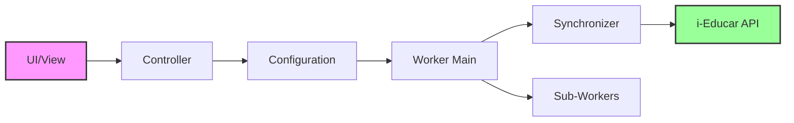
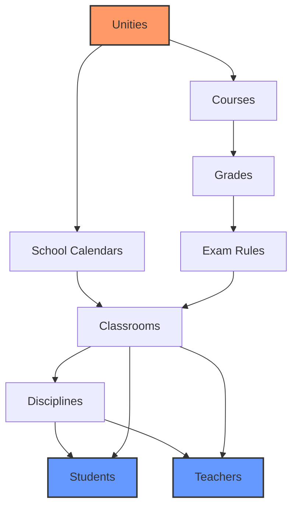
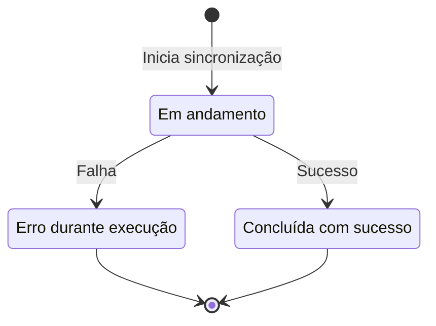

# Sistema de Sincronização com i-Educar

## Visão Geral

O i-Diário sincroniza dados com o sistema i-Educar através de uma API REST. A sincronização é executada de forma assíncrona usando Sidekiq e pode ser incremental ou completa.

## Arquitetura

### Fluxo Geral de Sincronização



### Componentes Principais

1. **IeducarApiConfiguration** - Armazena credenciais e configurações da API
2. **IeducarApiSynchronization** - Registra cada execução de sincronização
3. **Workers** - Processamento assíncrono das sincronizações
4. **Synchronizers** - Classes que executam a sincronização de cada entidade
5. **API Client** - Comunicação com a API do i-Educar

## Tipos de Sincronização

### 1. Sincronização Incremental

- **Quando**: Executada diariamente ou sob demanda
- **O que sincroniza**: Apenas registros modificados desde a última sincronização
- **Como funciona**: Usa o parâmetro `modified` com a data da última sincronização

```ruby
# Busca apenas registros modificados após a data
params[:modified] = last_synchronization_date
```

### 2. Sincronização Completa (com Período Customizado)

- **Quando**: Primeira sincronização ou correção de dados
- **Requer permissão**: Feature `full_synchronization` (admin ou usuários autorizados)
- **Períodos disponíveis**:
  - **Ano atual**: Sincroniza apenas o ano corrente
  - **Últimos 2 anos**: Sincroniza os últimos 2 anos
- **Período automático** (quando não customizado):
  - Janeiro a Março: 2 anos
  - Abril a Dezembro: 1 ano (ou 2 se já houver calendário do próximo ano)

```ruby
# app/services/ieducar_synchronizers/default_synchronizer.rb
def slice_years(years)
  if @synchronization.period.present?
    case @synchronization.period
    when SynchronizationPeriods::CURRENT_YEAR
      years.take(1)
    when SynchronizationPeriods::LAST_TWO_YEARS
      years.take(2)
    else
      default_slice_years(years)
    end
  else
    default_slice_years(years)
  end
end
```

## Ordem de Sincronização

A sincronização segue uma ordem específica devido às dependências entre entidades:



```yaml
# config/synchronization_configs.yml
unities:
  klass: IeducarSynchronizers::UnitiesSynchronizer
  dependencies: []

courses:
  klass: IeducarSynchronizers::CoursesSynchronizer
  dependencies: [unities]

grades:
  klass: IeducarSynchronizers::GradesSynchronizer
  dependencies: [courses]

school_calendars:
  klass: IeducarSynchronizers::SchoolCalendarsSynchronizer
  dependencies: [unities]

classrooms:
  klass: IeducarSynchronizers::ClassroomsSynchronizer
  dependencies: [grades, school_calendars, exam_rules]

students:
  klass: IeducarSynchronizers::StudentsSynchronizer
  dependencies: [classrooms, disciplines]

teachers:
  klass: IeducarSynchronizers::TeachersSynchronizer
  dependencies: [classrooms, disciplines]
```

## Workers e Processamento Assíncrono

### IeducarSynchronizerWorker

Worker principal que inicia o processo:

```ruby
class IeducarSynchronizerWorker
  include Sidekiq::Worker
  
  sidekiq_options queue: :synchronizer,
                  unique: :until_and_while_executing
  
  def perform(entity_id, synchronization_id, full_synchronization, current_years, period)
    # Inicia a cadeia de sincronização
    UnitiesSynchronizerWorker.perform_async(
      entity_id: entity_id,
      synchronization_id: synchronization_id,
      current_years: current_years,
      period: period
    )
  end
end
```

### Filas Sidekiq

- **synchronizer**: Sincronizações incrementais (prioridade normal)
- **synchronizer_full**: Sincronizações completas (prioridade baixa)

## Configuração da API

### Acessando as Configurações

Menu: **Configurações → API de integração**

### IeducarApiConfiguration

```ruby
# Campos principais
- url            # URL base da API do i-Educar
- token          # Token de acesso (access_key)
- secret_token   # Token secreto (secret_key)
- unity_code     # Código da unidade no i-Educar
```

### Autenticação

A API utiliza autenticação por tokens:

```ruby
# app/services/ieducar_api/base.rb
def request(method, params)
  payload = {
    access_key: access_key,
    secret_key: secret_key,
    unity_id: unity_id
  }
  
  RestClient::Request.execute(
    method: method,
    url: endpoint,
    payload: payload.merge(params)
  )
end
```

## Estados da Sincronização



```ruby
# app/enumerations/api_synchronization_status.rb
class ApiSynchronizationStatus < EnumerateIt::Base
  associate_values :started,    # Em andamento
                   :completed,  # Concluída com sucesso
                   :error      # Erro durante execução
end
```

### Monitoramento

- **WorkerBatch**: Agrupa todos os workers de uma sincronização
- **WorkerState**: Estado individual de cada worker
- **Progresso**: Calculado com base nos workers concluídos

```ruby
# Cálculo de progresso
def done_percentage
  return 0 if worker_batch.blank?
  
  total = worker_batch.total_workers
  completed = worker_batch.completed_workers
  
  (completed.to_f / total * 100).round
end
```

## Tratamento de Erros

### Retry Automático

Workers têm retry automático configurado:

```ruby
sidekiq_options retry: 3, dead: false
```

### Erros Comuns

1. **Timeout de Rede**: 
   - Timeout configurado: 240 segundos
   - Erros de rede são capturados e reprocessados

2. **Dados Inválidos**:
   - Validações falham: registro é pulado
   - Log de erro é criado

3. **Sincronização Travada**:
   - Detectada após 2 horas sem atualização
   - Pode ser cancelada manualmente

## Interface de Usuário

Para acessar a sincronização: Menu **Configurações → API de integração**

### Botões de Sincronização

```erb
<!-- Usuários com permissão full_synchronization -->
<%= link_to t('.synchronize_current_year'), 
  synchronizations_path(period: SynchronizationPeriods::CURRENT_YEAR),
  method: 'post', class: 'btn bg-color-blue' %>

<%= link_to t('.synchronize_last_two_years'), 
  synchronizations_path(period: SynchronizationPeriods::LAST_TWO_YEARS),
  method: 'post', class: 'btn bg-color-red' %>

<!-- Usuários sem permissão -->
<%= link_to t('.synchronize'), 
  synchronizations_path,
  method: 'post', class: 'btn bg-color-red' %>
```

### Status em Tempo Real

O status é atualizado via JavaScript:

```javascript
// Polling a cada 5 segundos
setInterval(updateSyncStatus, 5000);

function updateSyncStatus() {
  $.get('/synchronizations/current_syncronization_data', function(data) {
    updateProgressBar(data.done_percentage);
    updateTimeRunning(data.time_running);
  });
}
```

## Boas Práticas

### 1. Frequência de Sincronização

- **Recomendado**: Sincronização incremental diária
- **Evitar**: Múltiplas sincronizações completas no mesmo dia
- **Horário ideal**: Fora do horário comercial

### 2. Permissões

- Sincronização incremental: Disponível para todos
- Sincronização completa com período customizado: Requer feature `full_synchronization`

### 3. Monitoramento

```ruby
# Verificar sincronizações travadas
IeducarApiSynchronization.started.where(
  "updated_at < ?", 2.hours.ago
).each do |sync|
  sync.mark_as_error!("Sincronização travada")
end
```

### 4. Performance

- Use filas separadas para sincronizações completas
- Limite sincronizações simultâneas por entidade
- Monitore uso de memória dos workers

## Troubleshooting

### Sincronização não inicia

1. Verificar configuração da API
2. Verificar se Sidekiq está rodando
3. Verificar se não há outra sincronização em andamento

### Sincronização travada

1. Verificar logs do Sidekiq
2. Verificar conectividade com API
3. Cancelar e reiniciar se necessário

### Dados não sincronizados

1. Verificar período de sincronização
2. Verificar se dados existem no i-Educar
3. Verificar logs de erro da sincronização

## Logs e Debugging

### Logs Importantes

```ruby
# Log de início
Rails.logger.info(
  key: 'IeducarApiConfiguration#start_synchronization',
  sync_id: synchronization.id,
  entity_id: entity_id
)

# Log de erro
Rails.logger.error(
  key: 'SynchronizationError',
  message: exception.message,
  backtrace: exception.backtrace
)
```

### Console Rails

```ruby
# Verificar última sincronização
IeducarApiSynchronization.last

# Verificar sincronizações com erro
IeducarApiSynchronization.where(status: ApiSynchronizationStatus::ERROR)

# Forçar sincronização manual
config = IeducarApiConfiguration.current
config.start_synchronization(User.first, Entity.first.id, true)
```

## Conclusão

O sistema de sincronização do i-Diário permite manter os dados atualizados com o i-Educar através de processamento assíncrono. Embora funcional, o sistema atual apresenta desafios que geram reclamações frequentes dos clientes:

### Pontos de Atenção

- **Confiabilidade**: Sincronizações podem falhar ou travar sem notificação adequada
- **Performance**: Sincronizações completas podem levar horas e impactar o sistema
- **Monitoramento**: Falta visibilidade do progresso real e logs detalhados
- **Recuperação**: Dificuldade para recuperar de falhas parciais

### Melhorias Planejadas

O sistema está planejado para refatoração visando:
- Maior confiabilidade e resiliência a falhas
- Melhor feedback de progresso ao usuário
- Sincronização incremental mais inteligente
- Sistema de notificações de erros
- Logs mais detalhados para troubleshooting